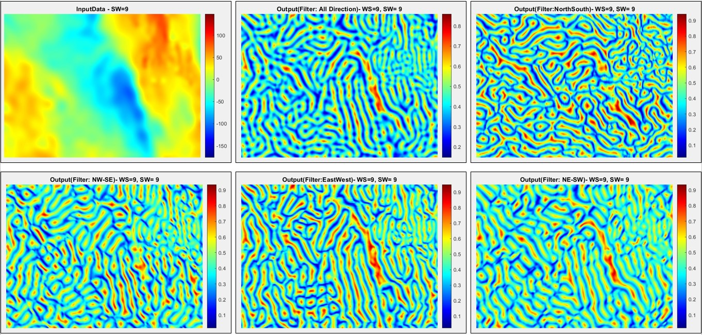

# GravMagGreyTransDirectionEdge

**Scope of Program Field: Gravity, Magnetic & Remote Sensing Dataset**

_**Platform: MATLAB**_

_**Program File name : start_LineamentGreyLevelsNSTD.m**_

The program calculates the Gray Level Transformed Directional Normalized Standard Deviations (NSTD) for Edge Detection.

It takes the 2D gridded points input (Irap Classic Points format) such as Input File Format (X(Integer) Y(Integer) Z(Float)) - XY in ascending order top to bottom direction of Input data: 1. West to East: Left to Right, 2. South to North: Top to Bottom

Input File can be Regular spaced Rectangular/Square Grid Points or may be Regular spaced Oblique Grid Points, which is padded with nearest outer points to make it Regular spaced Rectangular Grid Points.

>Sample input ASCII file (Regular spaced Rectangular Grid Points), PDF file & output ASCII file are attached for the reference in the folder **./Reference**

------------------------------------------------------------------------------------------
**Runtime Input Parameters**:

Size of Filtering Window (positive odd numbers only), minimum default =3

Size of Smoothing Window (positive odd numbers only), zero or -ve values apply no smoothing

Gray Level Transformation Levels, positive value only

Multi-Direction Flag = Y/N, Yes/No

------------------------------------------------------------------------------------------

**Outputs are followings**: 

NSTD (All Direction) = NSTD for all values (360 deg)

Additionally, if multi-Direction flag is Y/Yes

NSTD(East-West) = Filtered NSTD for East West Direction - Edge/Lineament along North South effective Direction

NSTD(North-South) = Filtered NSTD for North South Direction - Edge/Lineament along East West effective Direction

NSTD_NWSE = Filtered NSTD for NW-SE Direction - Edge/Lineament along effective NE-SW Direction

NSTD_NESW = Filtered NSTD for NE-SW Direction - Edge/Lineament along effective NW-SE Direction

------------------------------------------------------------------------------------------

**Sample output image (zoomed)**:

Open source Free Air Gravity data downloaded from the following site: https://topex.ucsd.edu/cgi-bin/get_data.cgi

------------------------------------------------------------------------------------------

**Output file (ASCII) format**:
  1. Petrel Points with attributes file or 
  2. Tab delimited Columnar file  

------------------------------------------------------------------------------------------
**References**:

* Gray-level transformation and Canny edge detection for 3D seismic discontinuity enhancement, Haibin Di, Dengliang Gao, SEG Houston 2013 Annual Meeting, http://dx.doi.org/10.1190/segam2013-1175.1

* Edge enhancement of potential-field data using normalized statistics, Gordon R. J. Cooper and Duncan R. Cowan, GEOPHYSICS, VOL. 73, NO. 3 MAY-JUNE 2008; P. H1–H4, https://doi.org/10.1190/1.2837309

------------------------------------------------------------------------------------------
The usage of the program is limited to its scope and user has to ascertain the program output applicability to its scope of work, accuracy etc.

Any help to highlight the issue(s) and/or suggestions will be greatly appreciated. 
Thank you.
  
**Prashant M. Sinha**
[e-mail:**sinha.pm@gmail.com**]

------------------------------------------------------------------------------------------
